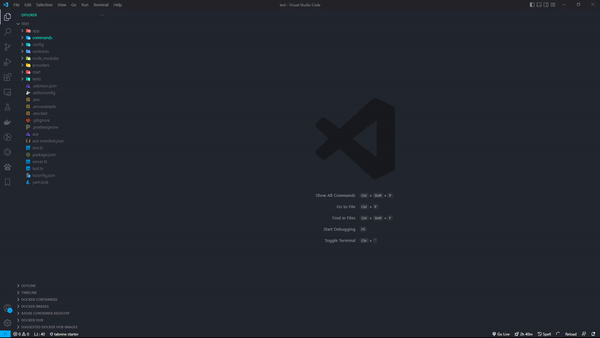

# AdonisJs Files    

vs code extension to quickly create **AdonisJs files** using **GUI**

## Features

Right click on any target folder in your current project.
You can find multiple options that has been added to the context menu:

Folder Menu Options  |
---           |
AdonisJs - Generate Command |
AdonisJs - Generate Controller |
AdonisJs - Generate Exception |
AdonisJs - Generate Factory |
AdonisJs - Generate Listener |
AdonisJs - Generate Middleware |
AdonisJs - Generate Migration |
AdonisJs - Generate Model |
AdonisJs - Generate Provider |
AdonisJs - Generate Seeder |
AdonisJs - Generate Suite |
AdonisJs - Generate Test |
AdonisJs - Generate Validator |
AdonisJs - Generate View |

### Example

Right click on controllers folder to generate a Controller

## Installation

1. Install Visual Studio Code 1.40.0 or higher
2. Launch Code
3. From the command palette `Ctrl`-`Shift`-`P` (Windows, Linux) or `Cmd`-`Shift`-`P` (OSX)
4. Select `Install Extension`
5. Type `adonisjs files` and press enter
6. Install

# License
MIT

*inspired on NestJs Files*
**Enjoy!**
